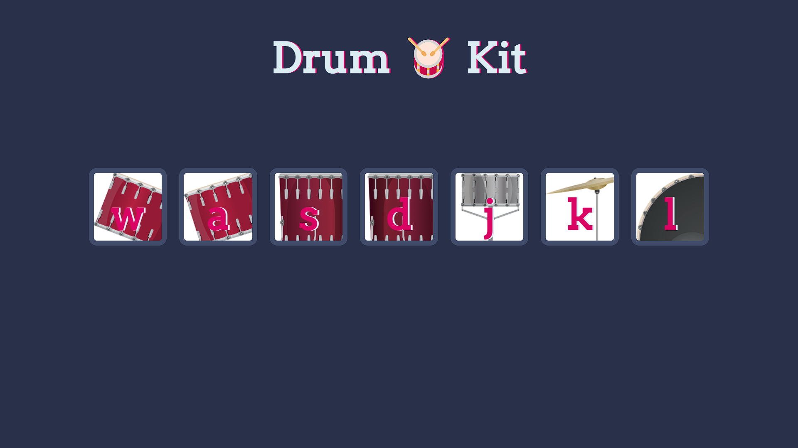

# 🥁 Drum Kit 🎶

This is a fun and interactive virtual drum kit built using **HTML**, **CSS**, and **JavaScript**. You can play different drum sounds by either clicking the drum buttons or pressing specific keys on your keyboard.

---

## 🚀 Live Demo

👉 [Click here to play the drum kit](https://manoj-9899.github.io/drum-kit-mini-project/)  

---

## 📁 Project Structure

drum-kit/
├── index.html          # Main HTML file (with footer)
├── styles.css          # Styling using CSS
├── script.js           # JavaScript logic for sound and animation
├── README.md           # Project documentation
├── images/             # Contains background images and screenshot
│   ├── tom1.png
│   ├── tom2.png
│   ├── tom3.png
│   ├── tom4.png
│   ├── snare.png
│   ├── crash.png
│   ├── kick.png
│   └── drumkit-screenshot.png
├── sounds/             # Contains all drum sound files
│   ├── tom-1.mp3
│   ├── tom-2.mp3
│   ├── tom-3.mp3
│   ├── tom-4.mp3
│   ├── snare.mp3
│   ├── crash.mp3
│   └── kick-bass.mp3
└── LICENSE             # License file

---

## 🔑 Controls

| Key | Sound        |
|-----|--------------|
| W   | Tom 1        |
| A   | Tom 2        |
| S   | Tom 3        |
| D   | Tom 4        |
| J   | Snare        |
| K   | Crash Cymbal |
| L   | Kick Bass    |

Click the buttons or press the keys to play the drum sounds.

---

## 🛠️ Technologies Used

- HTML5
- CSS3
- JavaScript (ES6)
- DOM Manipulation
- Event Handling

---

## 📸 Screenshots

Example:  

---

## 💡 Future Enhancements

- Record and replay user beats
- Add touch support for mobile devices
- Add glowing or animated effects on key press
- Visual beat patterns or metronome feature

---

## 👨‍💻 Author

**Manoj Shivaji Pawar**  
🔗 [GitHub Profile](https://github.com/manoj-9899) 

---

## 📄 License

This project is open source and available under the [MIT License](LICENSE).
